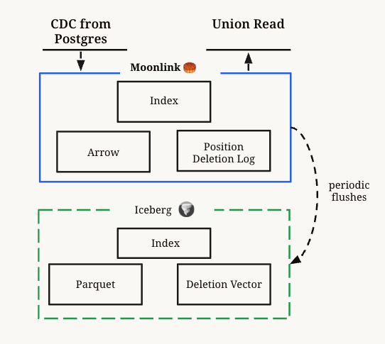

# moonlink 🥮
Real-Time Postgres to Iceberg Mirroring 

## Overview

Moonlink is a Rust library that enables sub-second mirroring (CDC) of Postgres tables into [Iceberg](https://iceberg.apache.org/). It serves as a drop-in replacement for the Debezium + Kafka + Flink + Spark stack. 

Under the hood, it extends Iceberg with a real-time storage engine optimized for low-latency, high-throughput ingestion from update-heavy sources like Postgres logical replication.

> **Note:** Moonlink is in preview. Expect changes. Join our [Community](https://join.slack.com/t/mooncakelabs/shared_invite/zt-2sepjh5hv-rb9jUtfYZ9bvbxTCUrsEEA) to stay updated!

## Features
- **Sub-second Ingestion**: Including updates and deletes
- **Real-time Reads**: Unified view combining in-memory state and Iceberg files
- **Iceberg-native Optimizations**: Implements deletion vectors and compaction to maintain read performance
- **Simple Deployment**: Single Rust library that can be embedded ([pg_mooncake](https://github.com/Mooncake-Labs/pg_mooncake)) or scaled out

Moonlink makes deep optimizations for Iceberg as the destination, unlike most replication tools that treat it as a black box.

## Architecture

Moonlink extends Iceberg with a thin [Arrow](https://arrow.apache.org/) buffer with indexes and a positional deletion log. This buffer efficiently handles hot incoming data; and will periodically flush to Iceberg. 

  

### Write Path

**Raw Inserts** 
- Rows are written to an Arrow buffer
- Buffer data is efficiently flushed to Parquet when full

**Raw Deletions**
- Moonlink maintains primary key indexes for all rows
- Deletions update the positional deletion log using these indexes
- Periodically, deletion logs are converted to Iceberg v3 deletion vectors.

### Read Path

Moonlink exposes a union read interface that combines its in-memory state with Iceberg files. 

Engines can use this union-read interface to access the most current table state. For eg: [pg_mooncake v0.2](https://github.com/Mooncake-Labs/pg_mooncake/) uses this for sub-second consistency between Postgres and Columnstore (Iceberg) tables.

> **Note:** Moonlink writes Iceberg tables with deletion vectors (Iceberg v3). Check your query engine for deletion vector support.

### Connectors

Moonlink can support multiple input data sources through [moonlink-connectors](https://github.com/Mooncake-Labs/moonlink-connectors). Currently, only Postgres logical replication is supported as a source. 

Feel free [request](https://join.slack.com/t/mooncakelabs/shared_invite/zt-2sepjh5hv-rb9jUtfYZ9bvbxTCUrsEEA) more connectors or open a PR!

## Sample Usage

Today, Moonlink can be used as a library. We have two sample examples of Moonlink being use:
1. The **[pg_mooncake](https://github.com/Mooncake-Labs/pg_mooncake/)** Postgres extension:

   pg_mooncake runs moonlink as a Background Worker Process that:
   - Manages tables and CDC ingestion
   - Processes union read requests

2. **[moonlink-backend test](https://github.com/Mooncake-Labs/moonlink/blob/main/src/moonlink_backend/tests/test_backend.rs)**  
A demo of `moonlink-backend` running as a server, replicating Postgres tables to Iceberg.

## Roadmap

### Short term
**Iceberg Integration**
- [ ] Integration & productionize more Iceberg Catalogs
- [ ] Iceberg DataFile Optimization & Compaction

**Performance Optimization**
- [ ] Read/Write Cache
- [ ] Index Optimization
  
**Data Types**
- [ ] Composite types in connector

### Mid term
**Iceberg Integration**
- [ ] Partitioning & Clustering
- [ ] Schema Evolution
- [ ] Iceberg V3 types: Geospatial & Variant

**Functionality**
- [ ] Expose Index_Read interface for fast lookup queries.
- [ ] Implement Other index types: Inverted-index, Full-text search, Vector.

**Deployability**
- [ ] Deploy Moonlink as standalone service

 
🥮

